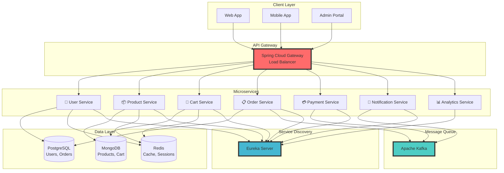

```markdown
<div align="center">
  
  
  # 🛍️ Cloud E-Commerce Platform
  
  <p align="center">
    <strong>A modern, scalable microservices-based e-commerce platform built with Spring Boot</strong>
  </p>
  
  <p align="center">
    <a href="#demo">View Demo</a>
    •
    <a href="#features">Features</a>
    •
    <a href="#tech-stack">Tech Stack</a>
    •
    <a href="#getting-started">Getting Started</a>
    •
    <a href="#api-docs">API Docs</a>
  </p>
  
  <p align="center">
    
    
    
    
  </p>
</div>

---

## 📋 Table of Contents

- [✨ Features](#features)
- [🏗️ Architecture](#architecture)
- [🛠️ Tech Stack](#tech-stack)
- [🚀 Getting Started](#getting-started)
- [📦 Services](#services)
- [🔧 Configuration](#configuration)
- [📚 API Documentation](#api-documentation)
- [🧪 Testing](#testing)
- [📈 Monitoring](#monitoring)
- [🤝 Contributing](#contributing)

---

## ✨ Features

<table>
  <tr>
    <td>
      <h3>🛒 E-Commerce Core</h3>
      <ul>
        <li>✅ Product Catalog Management</li>
        <li>✅ Shopping Cart & Wishlist</li>
        <li>✅ Order Processing</li>
        <li>✅ Payment Integration</li>
        <li>✅ Inventory Management</li>
      </ul>
    </td>
    <td>
      <h3>🔐 Security & Auth</h3>
      <ul>
        <li>✅ JWT Authentication</li>
        <li>✅ OAuth2 with Keycloak</li>
        <li>✅ Role-Based Access Control</li>
        <li>✅ API Rate Limiting</li>
        <li>✅ Secure Payment Processing</li>
      </ul>
    </td>
  </tr>
  <tr>
    <td>
      <h3>⚡ Performance</h3>
      <ul>
        <li>✅ Redis Caching</li>
        <li>✅ Async Processing</li>
        <li>✅ Database Optimization</li>
        <li>✅ CDN Integration</li>
        <li>✅ Load Balancing</li>
      </ul>
    </td>
    <td>
      <h3>📊 Monitoring & Analytics</h3>
      <ul>
        <li>✅ Distributed Tracing (Zipkin)</li>
        <li>✅ Metrics (Prometheus)</li>
        <li>✅ Centralized Logging (ELK)</li>
        <li>✅ Real-time Dashboards</li>
        <li>✅ Business Analytics</li>
      </ul>
    </td>
  </tr>
</table>

---

## 🏗️ Architecture

<div align="center">



</div>

---

## 🛠️ Tech Stack

<div align="center">

| Category | Technologies |
|----------|-------------|
| **Backend** |    |
| **Microservices** |    |
| **Databases** |    |
| **Message Queue** |  |
| **Security** |   |
| **Monitoring** |   |
| **DevOps** |   |

</div>

---

## 🚀 Getting Started

### Prerequisites

- **Java 17** or higher
- **Docker** & **Docker Compose**
- **Maven 3.8+**
- **Git**

### 🏃‍♂️ Quick Start

1. **Clone the repository**
   ```bash
   git clone https://github.com/khan-sk-dev/cloud-ecommerce-platform.git
   cd cloud-ecommerce-platform
   ```

2. **Start infrastructure services**
   ```bash
   docker-compose up -d
   ```

3. **Build all services**
   ```bash
   mvn clean package -DskipTests
   ```

4. **Run services** (in separate terminals)
   ```bash
   # Eureka Server
   cd eureka-server && mvn spring-boot:run

   # API Gateway
   cd api-gateway && mvn spring-boot:run

   # Start other services...
   cd user-service && mvn spring-boot:run
   ```

5. **Access the application**
   - 🌐 **API Gateway**: http://localhost:8080
   - 📊 **Eureka Dashboard**: http://localhost:8761
   - 🔐 **Keycloak Admin**: http://localhost:9098
   - 📈 **Zipkin UI**: http://localhost:9411

---

## 📦 Services

<div align="center">

| Service | Port | Description | Status |
|---------|------|-------------|--------|
| 🌐 **API Gateway** | 8080 | Routes requests to microservices |  |
| 🔍 **Eureka Server** | 8761 | Service discovery and registration |  |
| 👤 **User Service** | 8081 | User management and authentication |  |
| 📦 **Product Service** | 8082 | Product catalog and inventory |  |
| 🛒 **Cart Service** | 8083 | Shopping cart management |  |
| 📋 **Order Service** | 8084 | Order processing and tracking |  |
| 💳 **Payment Service** | 8085 | Payment processing |  |
| 📧 **Notification Service** | 8086 | Email/SMS notifications |  |
| 📊 **Analytics Service** | 8087 | Business analytics and reporting |  |

</div>

---

## 🔧 Configuration

### Environment Variables

Create `.env` file in the root directory:

```env
# Database Configuration
POSTGRES_USER=ecommerce_user
POSTGRES_PASSWORD=your_secure_password
POSTGRES_DB=ecommerce_db

# MongoDB Configuration
MONGO_ROOT_USERNAME=mongo_admin
MONGO_ROOT_PASSWORD=your_secure_password

# Redis Configuration
REDIS_PASSWORD=your_redis_password

# Keycloak Configuration
KEYCLOAK_ADMIN=admin
KEYCLOAK_ADMIN_PASSWORD=admin_password

# Kafka Configuration
KAFKA_BOOTSTRAP_SERVERS=localhost:9092

# JWT Secret
JWT_SECRET=your_super_secret_jwt_key_here
```

### Application Properties

Each service has its own `application.yml`:

```yaml
spring:
  application:
    name: ${SERVICE_NAME}
  cloud:
    config:
      uri: http://localhost:8888
  
eureka:
  client:
    service-url:
      defaultZone: http://localhost:8761/eureka/

management:
  tracing:
    sampling:
      probability: 1.0
  endpoints:
    web:
      exposure:
        include: health,info,metrics,prometheus
```

---

## 📚 API Documentation

### 🔑 Authentication

All API requests require JWT token in the header:
```http
Authorization: Bearer <your-jwt-token>
```

### 📍 Main Endpoints

<details>
<summary><b>User Service APIs</b></summary>

#### Register User
```http
POST /api/v1/users/register
Content-Type: application/json

{
  "username": "john_doe",
  "email": "john@example.com",
  "password": "SecurePass123!",
  "firstName": "John",
  "lastName": "Doe"
}
```

#### Login
```http
POST /api/v1/auth/login
Content-Type: application/json

{
  "username": "john_doe",
  "password": "SecurePass123!"
}
```

</details>

<details>
<summary><b>Product Service APIs</b></summary>

#### Get All Products
```http
GET /api/v1/products?page=0&size=20&sort=name,asc
```

#### Create Product (Admin only)
```http
POST /api/v1/products
Content-Type: application/json
Authorization: Bearer <admin-token>

{
  "name": "iPhone 15 Pro",
  "description": "Latest Apple smartphone",
  "price": 999.99,
  "category": "ELECTRONICS",
  "stock": 100,
  "images": ["url1", "url2"]
}
```

</details>

<details>
<summary><b>Order Service APIs</b></summary>

#### Create Order
```http
POST /api/v1/orders
Content-Type: application/json

{
  "items": [
    {
      "productId": "prod-123",
      "quantity": 2,
      "price": 999.99
    }
  ],
  "shippingAddress": {
    "street": "123 Main St",
    "city": "New York",
    "zipCode": "10001"
  }
}
```

</details>

### 📖 Swagger UI

Access interactive API documentation at:
- **API Gateway Swagger**: http://localhost:8080/swagger-ui.html
- **Individual Service Swagger**: http://localhost:{service-port}/swagger-ui.html

---

## 🧪 Testing

### Run Unit Tests
```bash
mvn test
```

### Run Integration Tests
```bash
mvn verify
```

### Run All Tests with Coverage
```bash
mvn clean test jacoco:report
```

### Load Testing
```bash
# Using Apache JMeter
jmeter -n -t tests/load-test-plan.jmx -l results.jtl
```

---

## 📈 Monitoring

### 📊 Metrics & Dashboards

<div align="center">

| Tool | URL | Purpose |
|------|-----|---------|
| **Zipkin** | http://localhost:9411 | Distributed tracing |
| **Prometheus** | http://localhost:9090 | Metrics collection |
| **Grafana** | http://localhost:3000 | Metrics visualization |
| **ELK Stack** | http://localhost:5601 | Centralized logging |

</div>

### 🔍 Health Checks

Check service health:
```bash
curl http://localhost:8080/actuator/health
```

---

## 🐳 Docker Deployment

### Build Docker Images
```bash
# Build all services
docker-compose build

# Or build individual service
docker build -t ecommerce/user-service:latest ./user-service
```

### Run with Docker Compose
```bash
# Start all services
docker-compose up -d

# Scale specific service
docker-compose up -d --scale product-service=3

# View logs
docker-compose logs -f user-service
```

### Kubernetes Deployment

```bash
# Apply all manifests
kubectl apply -f k8s/

# Check deployments
kubectl get deployments -n ecommerce

# Check services
kubectl get services -n ecommerce
```

---

## 🤝 Contributing

We welcome contributions! Please see our [Contributing Guidelines](CONTRIBUTING.md).

### How to Contribute

1. **Fork the repository**
2. **Create your feature branch**
   ```bash
   git checkout -b feature/AmazingFeature
   ```
3. **Commit your changes**
   ```bash
   git commit -m 'Add some AmazingFeature'
   ```
4. **Push to the branch**
   ```bash
   git push origin feature/AmazingFeature
   ```
5. **Open a Pull Request**

### Code Style

- Follow [Google Java Style Guide](https://google.github.io/styleguide/javaguide.html)
- Write unit tests for new features
- Ensure all tests pass before submitting PR
- Update documentation as needed

---

## 📝 License

This project is licensed under the MIT License - see the [LICENSE](LICENSE) file for details.

---

## 🌟 Acknowledgments

- Spring Boot team for the amazing framework
- Netflix OSS for microservices tools
- All contributors who have helped shape this project

---

## 📞 Contact & Support

<div align="center">

[](https://linkedin.com/in/your-profile)
[](https://twitter.com/your-handle)
[](mailto:your-email@example.com)

### ⭐ Star this repo if you find it helpful!

</div>

---

<div align="center">
  <sub>Built with ❤️ by the Cloud E-Commerce Team</sub>
</div>
```
