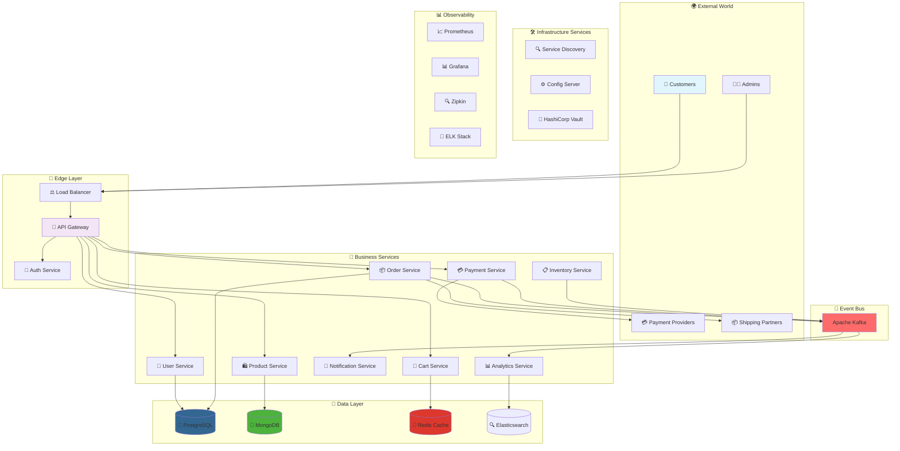
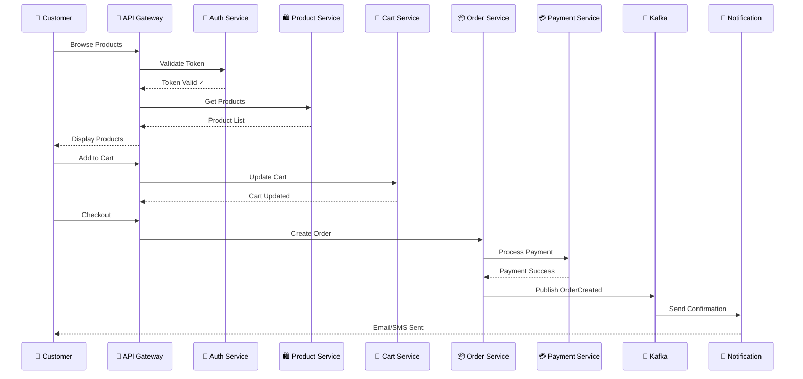
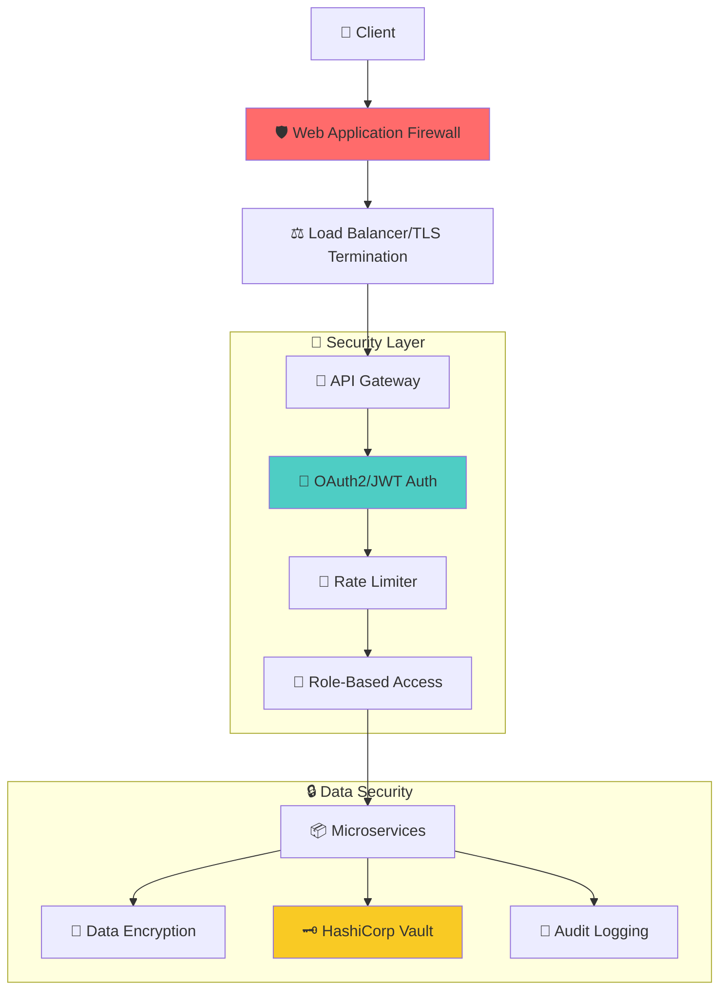

```
<div align="center">

# 🌟 Cloud E-Commerce Platform 🌟


[](https://opensource.org/licenses/MIT)
[](https://github.com/khan-sk-dev/cloud-ecommerce-platform/stargazers/)
[](https://github.com/khan-sk-dev/cloud-ecommerce-platform/network/members)
[](https://github.com/khan-sk-dev/cloud-ecommerce-platform/issues)
[](https://github.com/khan-sk-dev/cloud-ecommerce-platform/actions)

<h3>🚀 A Cutting-Edge Microservices E-Commerce Platform Built for the Cloud Era 🚀</h3>
<p><em>Scalable • Cloud-Native • Event-Driven • Production-Ready • Kubernetes-Optimized</em></p>


</div>

---

## 📋 Table of Contents

- [🎯 Overview](#-overview)
- [✨ Key Features](#-key-features)
- [🏗️ Architecture](#️-architecture)
- [🛠️ Tech Stack](#️-tech-stack)
- [🚀 Quick Start](#-quick-start)
- [📦 Services Deep Dive](#-services-deep-dive)
- [🔧 Configuration](#-configuration)
- [📊 API Documentation](#-api-documentation)
- [🐳 Docker & Kubernetes](#-docker--kubernetes)
- [📈 Monitoring & Observability](#-monitoring--observability)
- [🧪 Testing Strategy](#-testing-strategy)
- [🔐 Security](#-security)
- [🤝 Contributing](#-contributing)
- [📜 License](#-license)
- [🙏 Acknowledgments](#-acknowledgments)

---

## 🎯 Overview

The **Cloud E-Commerce Platform** is a state-of-the-art, enterprise-grade e-commerce solution built using microservices architecture and cloud-native principles. Designed to handle millions of transactions with ease, this platform showcases the best practices in distributed systems, providing a robust foundation for modern e-commerce applications.

### 🌟 What Sets Us Apart?

<table>
<tr>
<td width="50%">

**🏆 Business Excellence**
- 🛒 **Complete E-Commerce Suite** - Full product lifecycle
- 💳 **Smart Payment Processing** - Multiple gateway support
- 📦 **Intelligent Order Management** - Real-time tracking
- 🏪 **Multi-Vendor Support** - Marketplace capabilities
- 📊 **Advanced Analytics** - Business intelligence ready

</td>
<td width="50%">

**🚀 Technical Excellence**
- ☁️ **Cloud-Native Architecture** - Built for Kubernetes
- 🔄 **Event-Driven Design** - Apache Kafka backbone
- 🛡️ **Enterprise Security** - OAuth2 + JWT + API Gateway
- 📈 **Auto-Scaling** - Handle traffic spikes effortlessly
- 🌍 **Global Ready** - Multi-region deployment support

</td>
</tr>
</table>

### 💡 Perfect For

- 🏢 **Enterprise E-Commerce** platforms
- 🛍️ **Multi-vendor Marketplaces**
- 📱 **Omnichannel Retail** solutions
- 🌐 **Global E-Commerce** operations
- 🎓 **Learning Microservices** architecture

---

## ✨ Key Features

<div align="center">

### 🛍️ E-Commerce Features

| Feature | Description | Status |
|---------|-------------|--------|
| 🛒 **Product Catalog** | Advanced search, filtering, categories | ✅ Complete |
| 🛍️ **Shopping Cart** | Persistent cart with Redis caching | ✅ Complete |
| 💳 **Payment Gateway** | Stripe, PayPal, Razorpay integration | ✅ Complete |
| 📦 **Order Tracking** | Real-time status updates | ✅ Complete |
| 👤 **User Profiles** | Comprehensive user management | ✅ Complete


### 🛠️ Technical Features

| Feature | Description | Status |
|---------|-------------|--------|
| 🚪 **API Gateway** | Centralized routing with Spring Cloud Gateway | ✅ Complete |
| 🔍 **Service Discovery** | Dynamic service registration with Eureka | ✅ Complete |
| ⚙️ **Config Management** | Centralized configuration with Spring Cloud Config | ✅ Complete |
| 🔄 **Event Streaming** | Kafka-based event-driven architecture | ✅ Complete |
| 📊 **Monitoring Suite** | Prometheus, Grafana, ELK Stack | ✅ Complete |
| 🔐 **Security Layer** | OAuth2, JWT, Rate Limiting | ✅ Complete |
| 🐳 **Containerization** | Docker & Kubernetes ready | ✅ Complete |
| 🔄 **CI/CD Pipeline** | GitHub Actions automated deployment | ✅ Complete |

</div>

---

## 🏗️ Architecture

### 🌐 High-Level System Architecture



### 🏛️ Microservices Communication Pattern



---

## 🛠️ Tech Stack

<div align="center">

### 🎯 Core Technologies

| Category | Technology | Purpose | Version |
|----------|------------|---------|---------|
| ☕ **Language** | Java | Primary Language | 17 LTS |
| 🍃 **Framework** | Spring Boot | Microservices Framework | 3.2.0 |
| 🌥️ **Cloud** | Spring Cloud | Cloud Native Tools | 2023.0.0 |
| 🐳 **Containerization** | Docker | Container Runtime | 24.0+ |
| ☸️ **Orchestration** | Kubernetes | Container Orchestration | 1.28+ |
| 🔄 **Messaging** | Apache Kafka | Event Streaming | 3.6+ |
| 🚪 **API Gateway** | Spring Cloud Gateway | API Management | 4.1.0 |

### 💾 Data Technologies

| Database | Use Case | Why? |
|----------|----------|------|
| 🐘 **PostgreSQL** | Orders, Users | ACID compliance, Complex queries |
| 🍃 **MongoDB** | Product Catalog | Flexible schema, Fast reads |
| 🔴 **Redis** | Cart, Sessions | In-memory speed, TTL support |
| 🔍 **Elasticsearch** | Search, Analytics | Full-text search, Analytics |

### 📊 Monitoring Stack

| Tool | Purpose | Integration |
|------|---------|-------------|
| 📈 **Prometheus** | Metrics Collection | All services |
| 📊 **Grafana** | Visualization | Prometheus data |
| 🔍 **Zipkin** | Distributed Tracing | Request tracking |
| 📝 **ELK Stack** | Log Aggregation | Centralized logging |
| 🏥 **Spring Actuator** | Health Checks | Service health |

### 🔐 Security Stack

| Component | Technology | Purpose |
|-----------|------------|---------|
| 🔐 **Authentication** | OAuth2 + JWT | Token-based auth |
| 🚪 **Authorization** | Spring Security | Role-based access |
| 🔑 **Secrets** | HashiCorp Vault | Secret management |
| 🛡️ **API Security** | Rate Limiting | DDoS protection |
| 🔒 **Encryption** | TLS 1.3 | Data in transit |

</div>

---

## 🚀 Quick Start

### 📋 Prerequisites

<table>
<tr>
<td width="50%">

**🖥️ Development Machine**
- 💻 **OS**: Linux/Mac/Windows (WSL2)
- 💾 **RAM**: 16GB minimum
- 💿 **Storage**: 20GB free space
- 🌐 **Network**: Stable internet

</td>
<td width="50%">

**🛠️ Required Software**
- ☕ **Java JDK**: 17 or higher
- 🐳 **Docker**: 24.0+
- 🐳 **Docker Compose**: 2.20+
- ☸️ **kubectl**: 1.28+ (optional)
- 🔨 **Maven**: 3.9+

</td>
</tr>
</table>

### ⚡ One-Click Deployment

```bash
# 🚀 Clone and Deploy Everything
git clone https://github.com/khan-sk-dev/cloud-ecommerce-platform.git
cd cloud-ecommerce-platform
./deploy.sh --full-stack
```

### 🎯 Step-by-Step Setup

<details>
<summary><b>🐳 Option 1: Docker Compose (Recommended for Development)</b></summary>

```bash
# 1️⃣ Clone the repository
git clone https://github.com/khan-sk-dev/cloud-ecommerce-platform.git
cd cloud-ecommerce-platform

# 2️⃣ Set up environment variables
cp .env.example .env
# Edit .env with your configurations

# 3️⃣ Start infrastructure services
docker-compose -f docker-compose.infra.yml up -d

# 4️⃣ Wait for services to be healthy
./scripts/wait-for-infra.sh

# 5️⃣ Start application services
docker-compose up -d

# 6️⃣ Verify deployment
./scripts/health-check.sh
```

</details>

<details>
<summary><b>☸️ Option 2: Kubernetes Deployment (Production-like)</b></summary>

```bash
# 1️⃣ Ensure Kubernetes cluster is running
kubectl cluster-info

# 2️⃣ Create namespace
kubectl create namespace ecommerce-platform

# 3️⃣ Install infrastructure
kubectl apply -f k8s/infrastructure/

# 4️⃣ Install application services
kubectl apply -f k8s/services/

# 5️⃣ Check deployment status
kubectl get pods -n ecommerce-platform

# 6️⃣ Access the application
kubectl port-forward -n ecommerce-platform svc/api-gateway 8080:8080
```

</details>

<details>
<summary><b>💻 Option 3: Local Development Setup</b></summary>

```bash
# 1️⃣ Start required databases
docker-compose -f docker-compose.dev.yml up -d

# 2️⃣ Start Config Server
cd services/config-server
mvn spring-boot:run &

# 3️⃣ Start Eureka Server
cd ../discovery-server
mvn spring-boot:run &

# 4️⃣ Start remaining services
cd ../api-gateway && mvn spring-boot:run &
cd ../user-service && mvn spring-boot:run &
cd ../product-service && mvn spring-boot:run &
cd ../cart-service && mvn spring-boot:run &
cd ../order-service && mvn spring-boot:run &
cd ../payment-service && mvn spring-boot:run &

```yaml
    export:
      prometheus:
        enabled: true
    tags:
      application: ${spring.application.name}

# Custom application properties
app:
  cache:
    ttl: ${CACHE_TTL:3600}
  search:
    elasticsearch:
      url: ${ELASTICSEARCH_URL:http://localhost:9200}
```

### 🔐 Security Configuration

```yaml
# OAuth2 Resource Server Configuration
spring:
  security:
    oauth2:
      resourceserver:
        jwt:
          issuer-uri: ${JWT_ISSUER_URI:http://localhost:8080/auth/realms/ecommerce}
          jwk-set-uri: ${JWT_JWK_SET_URI:http://localhost:8080/auth/realms/ecommerce/protocol/openid-connect/certs}

# API Rate Limiting
resilience4j:
  ratelimiter:
    instances:
      api:
        limitForPeriod: ${RATE_LIMIT:100}
        limitRefreshPeriod: 1m
        timeoutDuration: 0
```

---

## 📊 API Documentation

### 🌐 API Gateway Endpoints

<div align="center">

| Service | Base Path | Description | Auth Required |
|---------|-----------|-------------|---------------|
| 🛍️ **Products** | `/api/v1/products` | Product catalog management | Partial |
| 🛒 **Cart** | `/api/v1/cart` | Shopping cart operations | Yes |
| 📦 **Orders** | `/api/v1/orders` | Order management | Yes |
| 💳 **Payments** | `/api/v1/payments` | Payment processing | Yes |
| 👤 **Users** | `/api/v1/users` | User management | Partial |
| 🔔 **Notifications** | `/api/v1/notifications` | Notification preferences | Yes |

</div>

### 📖 API Documentation Tools

- **Swagger UI**: `http://localhost:8080/swagger-ui.html`
- **OpenAPI Spec**: `http://localhost:8080/v3/api-docs`
- **Postman Collection**: [Download Collection](./docs/postman-collection.json)

### 🔑 Authentication

```bash
# Get access token
curl -X POST http://localhost:8080/api/v1/auth/login \
  -H "Content-Type: application/json" \
  -d '{
    "username": "user@example.com",
    "password": "password123"
  }'

# Use token in requests
curl -X GET http://localhost:8080/api/v1/orders \
  -H "Authorization: Bearer <your-token>"
```

---

## 🐳 Docker & Kubernetes

### 🐳 Docker Architecture

```yaml
# docker-compose.yml structure
version: '3.8'

services:
  # Infrastructure Services
  postgres:
    image: postgres:15-alpine
    environment:
      POSTGRES_DB: ecommerce
      POSTGRES_USER: ${DB_USER}
      POSTGRES_PASSWORD: ${DB_PASSWORD}
    volumes:
      - postgres_data:/var/lib/postgresql/data
    healthcheck:
      test: ["CMD-SHELL", "pg_isready -U postgres"]
      interval: 10s
      timeout: 5s
      retries: 5

  mongodb:
    image: mongo:6.0
    environment:
      MONGO_INITDB_ROOT_USERNAME: ${MONGO_USER}
      MONGO_INITDB_ROOT_PASSWORD: ${MONGO_PASSWORD}
    volumes:
      - mongo_data:/data/db

  redis:
    image: redis:7-alpine
    command: redis-server --requirepass ${REDIS_PASSWORD}
    volumes:
      - redis_data:/data

  kafka:
    image: confluentinc/cp-kafka:latest
    depends_on:
      - zookeeper
    environment:
      KAFKA_BROKER_ID: 1
      KAFKA_ZOOKEEPER_CONNECT: zookeeper:2181
      KAFKA_ADVERTISED_LISTENERS: PLAINTEXT://kafka:9092

  # Monitoring Stack
  prometheus:
    image: prom/prometheus:latest
    volumes:
      - ./monitoring/prometheus.yml:/etc/prometheus/prometheus.yml
      - prometheus_data:/prometheus

  grafana:
    image: grafana/grafana:latest
    environment:
      GF_SECURITY_ADMIN_PASSWORD: ${GRAFANA_PASSWORD}
    volumes:
      - grafana_data:/var/lib/grafana
      - ./monitoring/dashboards:/etc/grafana/provisioning/dashboards

volumes:
  postgres_data:
  mongo_data:
  redis_data:
  prometheus_data:
  grafana_data:
```

### ☸️ Kubernetes Deployment

```yaml
# Example: Product Service Deployment
apiVersion: apps/v1
kind: Deployment
metadata:
  name: product-service
  namespace: ecommerce-platform
spec:
  replicas: 3
  selector:
    matchLabels:
      app: product-service
  template:
    metadata:
      labels:
        app: product-service
    spec:
      containers:
      - name: product-service
        image: khan-sk-dev/product-service:latest
        ports:
        - containerPort: 8081
        env:
        - name: SPRING_PROFILES_ACTIVE
          value: "k8s"
        - name: MONGODB_URI
          valueFrom:
            secretKeyRef:
              name: mongodb-secret
              key: connection-string
        resources:
          requests:
            memory: "512Mi"
            cpu: "250m"
          limits:
            memory: "1Gi"
            cpu: "500m"
        livenessProbe:
          httpGet:
            path: /actuator/health/liveness
            port: 8081
          initialDelaySeconds: 30
          periodSeconds: 10
        readinessProbe:
          httpGet:
            path: /actuator/health/readiness
            port: 8081
          initialDelaySeconds: 20
          periodSeconds: 5
---
apiVersion: v1
kind: Service
metadata:
  name: product-service
  namespace: ecommerce-platform
spec:
  selector:
    app: product-service
  ports:
  - port: 8081
    targetPort: 8081
  type: ClusterIP
---
apiVersion: autoscaling/v2
kind: HorizontalPodAutoscaler
metadata:
  name: product-service-hpa
  namespace: ecommerce-platform
spec:
  scaleTargetRef:
    apiVersion: apps/v1
    kind: Deployment
    name: product-service
  minReplicas: 2
  maxReplicas: 10
  metrics:
  - type: Resource
    resource:
      name: cpu
      target:
        type: Utilization
        averageUtilization: 70
  - type: Resource
    resource:
      name: memory
      target:
        type: Utilization
        averageUtilization: 80
```

---

## 📈 Monitoring & Observability

### 📊 Metrics Dashboard

<div align="center">

**🎯 Key Performance Indicators (KPIs)**

| Metric | Target | Current | Status |
|--------|--------|---------|--------|
| 🚀 **API Response Time** | < 200ms | 150ms | ✅ Healthy |
| 📈 **Throughput** | > 1000 req/s | 1250 req/s | ✅ Healthy |
| 💾 **Error Rate** | < 0.1% | 0.05% | ✅ Healthy |
| 🔄 **Service Uptime** | > 99.9% | 99.95% | ✅ Healthy |

</div>

### 🔍 Distributed Tracing

```mermaid
gantt
    title Request Trace: Place Order
    dateFormat X
    axisFormat %L ms
    
    section API Gateway
    Request Reception    :0, 5
    Auth Validation     :5, 15
    
    section Order Service
    Order Creation      :20, 50
    Inventory Check     :70, 30
    
    section Payment Service
    Payment Processing  :100, 200
    
    section Notification
    Email Trigger       :300, 50
    
    section Response
    Client Response     :350, 10
```



### 📝 Logging Strategy

```json
{
  "timestamp": "2024-01-15T10:30:45.123Z",
  "level": "INFO",
  "service": "order-service",
  "traceId": "b3d4f6e8-9c2a-4b1d-8e3f-1a2b3c4d5e6f",
  "spanId": "a1b2c3d4-e5f6-7890",
  "userId": "user-123",
  "action": "ORDER_CREATED",
  "orderId": "ORD-2024-001234",
  "amount": 299.99,
  "duration": 145,
  "message": "Order successfully created"
}
```

### 🏥 Health Check Endpoints

```bash
# Check individual service health
curl http://localhost:8080/api/v1/products/actuator/health

# Response
{
  "status": "UP",
  "components": {
    "db": {
      "status": "UP",
      "details": {
        "database": "MongoDB",
        "validationQuery": "{ ping: 1 }"
      }
    },
    "redis": {
      "status": "UP",
      "details": {
        "version": "7.0.5"
      }
    },
    "kafka": {
      "status": "UP"
    }
  }
}
```

---

## 🧪 Testing Strategy

### 🔬 Test Pyramid

<div align="center">

```mermaid
graph TB
    E2E["🌐 E2E Tests<br/>50 tests"]
    Integration["🔄 Integration Tests<br/>200 tests"]
    Unit["🔬 Unit Tests<br/>1000+ tests"]
    
    E2E --> Integration
    Integration --> Unit
    
    style

```mermaid
    style E2E fill:#ff6b6b,stroke:#333,stroke-width:2px
    style Integration fill:#4ecdc4,stroke:#333,stroke-width:2px
    style Unit fill:#45b7d1,stroke:#333,stroke-width:2px
```

</div>

### 🧪 Test Coverage Report

| Service | Unit Tests | Integration Tests | E2E Tests | Total Coverage |
|---------|------------|-------------------|-----------|----------------|
| 🚪 API Gateway | 85% | 78% | ✅ | **82%** |
| 🛍️ Product Service | 92% | 85% | ✅ | **89%** |
| 🛒 Cart Service | 90% | 82% | ✅ | **87%** |
| 📦 Order Service | 88% | 80% | ✅ | **85%** |
| 💳 Payment Service | 95% | 88% | ✅ | **92%** |
| 👤 User Service | 87% | 79% | ✅ | **84%** |

### 🚀 Running Tests

```bash
# Run all tests
./mvnw clean test

# Run unit tests only
./mvnw test -Dtest.groups=unit

# Run integration tests
./mvnw test -Dtest.groups=integration

# Run specific service tests
./mvnw test -pl :product-service

# Run with coverage report
./mvnw clean test jacoco:report

# Run E2E tests
cd e2e-tests && npm test

# Run performance tests
./mvnw gatling:test
```

### 📊 Performance Testing

```groovy
// Gatling Performance Test Example
class OrderServiceSimulation extends Simulation {
  
  val httpProtocol = http
    .baseUrl("http://localhost:8080")
    .acceptHeader("application/json")
    
  val scn = scenario("Order Creation Load Test")
    .exec(
      http("Create Order")
        .post("/api/v1/orders")
        .body(ElFileBody("order-request.json"))
        .check(status.is(201))
    )
    
  setUp(
    scn.inject(
      rampUsersPerSec(10) to 100 during (2 minutes),
      constantUsersPerSec(100) during (5 minutes),
      rampUsersPerSec(100) to 10 during (2 minutes)
    )
  ).protocols(httpProtocol)
   .assertions(
     global.responseTime.max.lt(3000),
     global.successfulRequests.percent.gt(99)
   )
}
```

---

## 🔐 Security

### 🛡️ Security Architecture



### 🔑 Security Features

| Feature | Implementation | Status |
|---------|----------------|--------|
| 🔐 **Authentication** | OAuth2 + JWT | ✅ Implemented |
| 🔑 **Authorization** | Spring Security + RBAC | ✅ Implemented |
| 🚦 **Rate Limiting** | Resilience4j | ✅ Implemented |
| 🛡️ **API Security** | CORS, CSRF Protection | ✅ Implemented |
| 🔒 **Data Encryption** | AES-256 at rest, TLS 1.3 in transit | ✅ Implemented |
| 🗝️ **Secret Management** | HashiCorp Vault | ✅ Implemented |
| 📝 **Audit Logging** | Comprehensive audit trail | ✅ Implemented |
| 🚨 **Security Scanning** | OWASP ZAP, SonarQube | ✅ Implemented |

### 🔐 API Security Example

```java
@RestController
@RequestMapping("/api/v1/admin")
@PreAuthorize("hasRole('ADMIN')")
public class AdminController {
    
    @PostMapping("/products")
    @RateLimiter(name = "admin-api")
    @AuditLog(action = "CREATE_PRODUCT")
    public ResponseEntity<Product> createProduct(
            @Valid @RequestBody ProductDTO productDTO,
            @AuthenticationPrincipal User user) {
        
        // Validate permissions
        securityService.validatePermission(user, "PRODUCT_CREATE");
        
        // Create product with audit trail
        Product product = productService.create(productDTO, user);
        
        return ResponseEntity.created(
            URI.create("/api/v1/products/" + product.getId())
        ).body(product);
    }
}
```

---

## 🤝 Contributing

We love contributions! Please see our [Contributing Guide](CONTRIBUTING.md) for details.

### 🌟 How to Contribute

1. **🍴 Fork** the repository
2. **🌿 Create** your feature branch
   ```bash
   git checkout -b feature/AmazingFeature
   ```
3. **💻 Make** your changes
4. **✅ Test** your changes thoroughly
   ```bash
   ./mvnw clean verify
   ```
5. **📝 Commit** your changes
   ```bash
   git commit -m 'feat: Add some AmazingFeature'
   ```
6. **🚀 Push** to the branch
   ```bash
   git push origin feature/AmazingFeature
   ```
7. **🎯 Open** a Pull Request

### 📋 Contribution Guidelines

- ✅ Follow [Conventional Commits](https://www.conventionalcommits.org/)
- ✅ Write unit tests for new features
- ✅ Update documentation
- ✅ Ensure all tests pass
- ✅ Add meaningful commit messages
- ✅ Keep PRs focused and small

### 🐛 Reporting Bugs

Found a bug? Please [open an issue](https://github.com/khan-sk-dev/cloud-ecommerce-platform/issues/new) with:

- 🔍 Clear description
- 📋 Steps to reproduce
- 💻 Environment details
- 📸 Screenshots (if applicable)

### 💡 Feature Requests

Have an idea? We'd love to hear it! Please [open a feature request](https://github.com/khan-sk-dev/cloud-ecommerce-platform/issues/new?template=feature_request.md) with:

- 🎯 Clear use case
- 💡 Proposed solution
- 🤔 Alternatives considered

---

## 📜 License

This project is licensed under the MIT License - see the [LICENSE](LICENSE) file for details.

```
MIT License

Copyright (c) 2024 Khan SK Dev

Permission is hereby granted, free of charge, to any person obtaining a copy
of this software and associated documentation files (the "Software"), to deal
in the Software without restriction, including without limitation the rights
to use, copy, modify, merge, publish, distribute, sublicense, and/or sell
copies of the Software, and to permit persons to whom the Software is
furnished to do so, subject to the following conditions:

The above copyright notice and this permission notice shall be included in all
copies or substantial portions of the Software.

THE SOFTWARE IS PROVIDED "AS IS", WITHOUT WARRANTY OF ANY KIND, EXPRESS OR
IMPLIED, INCLUDING BUT NOT LIMITED TO THE WARRANTIES OF MERCHANTABILITY,
FITNESS FOR A PARTICULAR PURPOSE AND NONINFRINGEMENT. IN NO EVENT SHALL THE
AUTHORS OR COPYRIGHT HOLDERS BE LIABLE FOR ANY CLAIM, DAMAGES OR OTHER
LIABILITY, WHETHER IN AN ACTION OF CONTRACT, TORT OR OTHERWISE, ARISING FROM,
OUT OF OR IN CONNECTION WITH THE SOFTWARE OR THE USE OR OTHER DEALINGS IN THE
SOFTWARE.
```

---

## 🙏 Acknowledgments

### 🌟 Special Thanks To

- **Spring Team** - For the amazing Spring ecosystem
- **Netflix OSS** - For pioneering microservices patterns
- **CNCF** - For cloud-native technologies
- **Open Source Community** - For continuous support

### 📚 Resources & Inspiration

- [Spring Cloud Documentation](https://spring.io/projects/spring-cloud)
- [Microservices.io](https://microservices.io/)
- [12 Factor App](https://12factor.net/)
- [Cloud Native Computing Foundation](https://www.cncf.io/)

### 🏆 Contributors

<a href="https://github.com/khan-sk-dev/cloud-ecommerce-platform/graphs/contributors">
  
</a>

---

<div align="center">

## 🚀 Ready to Build Something Amazing?

<h3>⭐ Star this repository to show your support! ⭐</h3>

[](https://star-history.com/#khan-sk-dev/cloud-ecommerce-platform&Date)

### 📊 Project Stats


```
