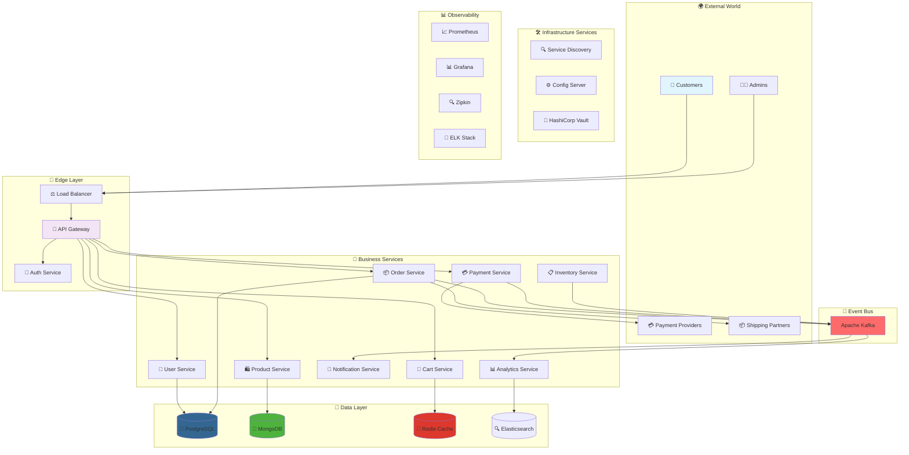
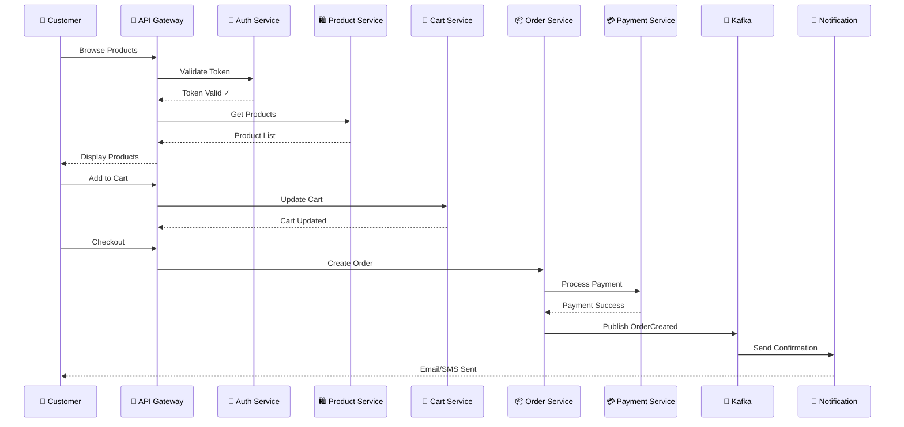

<div align="center">

# 🌟 Cloud E-Commerce Platform 🌟


[](https://opensource.org/licenses/MIT)
[](https://github.com/khan-sk-dev/cloud-ecommerce-platform/stargazers/)
[](https://github.com/khan-sk-dev/cloud-ecommerce-platform/network/members)
[](https://github.com/khan-sk-dev/cloud-ecommerce-platform/issues)
[](https://github.com/khan-sk-dev/cloud-ecommerce-platform/actions)

<h3>🚀 A Cutting-Edge Microservices E-Commerce Platform Built for the Cloud Era 🚀</h3>
<p><em>Scalable • Cloud-Native • Event-Driven • Production-Ready • Kubernetes-Optimized</em></p>


</div>

---

## 📋 Table of Contents

- [🎯 Overview](#-overview)
- [✨ Key Features](#-key-features)
- [🏗️ Architecture](#️-architecture)
- [🛠️ Tech Stack](#️-tech-stack)
- [🚀 Quick Start](#-quick-start)
- [📦 Services Deep Dive](#-services-deep-dive)
- [🔧 Configuration](#-configuration)
- [📊 API Documentation](#-api-documentation)
- [🐳 Docker & Kubernetes](#-docker--kubernetes)
- [📈 Monitoring & Observability](#-monitoring--observability)
- [🧪 Testing Strategy](#-testing-strategy)
- [🔐 Security](#-security)
- [🤝 Contributing](#-contributing)
- [📜 License](#-license)
- [🙏 Acknowledgments](#-acknowledgments)

---

## 🎯 Overview

The **Cloud E-Commerce Platform** is a state-of-the-art, enterprise-grade e-commerce solution built using microservices architecture and cloud-native principles. Designed to handle millions of transactions with ease, this platform showcases the best practices in distributed systems, providing a robust foundation for modern e-commerce applications.

### 🌟 What Sets Us Apart?

<table>
<tr>
<td width="50%">

**🏆 Business Excellence**
- 🛒 **Complete E-Commerce Suite** - Full product lifecycle
- 💳 **Smart Payment Processing** - Multiple gateway support
- 📦 **Intelligent Order Management** - Real-time tracking
- 🏪 **Multi-Vendor Support** - Marketplace capabilities
- 📊 **Advanced Analytics** - Business intelligence ready

</td>
<td width="50%">

**🚀 Technical Excellence**
- ☁️ **Cloud-Native Architecture** - Built for Kubernetes
- 🔄 **Event-Driven Design** - Apache Kafka backbone
- 🛡️ **Enterprise Security** - OAuth2 + JWT + API Gateway
- 📈 **Auto-Scaling** - Handle traffic spikes effortlessly
- 🌍 **Global Ready** - Multi-region deployment support

</td>
</tr>
</table>

### 💡 Perfect For
- 🏢 **Enterprise E-Commerce** platforms
- 🛍️ **Multi-vendor Marketplaces**
- 📱 **Omnichannel Retail** solutions
- 🌐 **Global E-Commerce** operations
- 🎓 **Learning Microservices** architecture

---

## ✨ Key Features

<div align="center">

### 🛍️ E-Commerce Features

| Feature | Description | Status |
|---------|-------------|--------|
| 🛒 **Product Catalog** | Advanced search, filtering, categories | ✅ Complete |
| 🛍️ **Shopping Cart** | Persistent cart with Redis caching | ✅ Complete |
| 💳 **Payment Gateway** | Stripe, PayPal, Razorpay integration | ✅ Complete |
| 📦 **Order Tracking** | Real-time status updates | ✅ Complete |
| 👤 **User Profiles** | Comprehensive user management | ✅ Complete |
| 🔔 **Notifications** | Email, SMS, Push notifications | ✅ Complete |
| 📊 **Analytics Dashboard** | Real-time business metrics | ✅ Complete |
| 🎁 **Promotions & Discounts** | Coupon and offer management | ✅ Complete |

### 🛠️ Technical Features

| Feature | Description | Status |
|---------|-------------|--------|
| 🚪 **API Gateway** | Centralized routing with Spring Cloud Gateway | ✅ Complete |
| 🔍 **Service Discovery** | Dynamic service registration with Eureka | ✅ Complete |
| ⚙️ **Config Management** | Centralized configuration with Spring Cloud Config | ✅ Complete |
| 🔄 **Event Streaming** | Kafka-based event-driven architecture | ✅ Complete |
| 📊 **Monitoring Suite** | Prometheus, Grafana, ELK Stack | ✅ Complete |
| 🔐 **Security Layer** | OAuth2, JWT, Rate Limiting | ✅ Complete |
| 🐳 **Containerization** | Docker & Kubernetes ready | ✅ Complete |
| 🔄 **CI/CD Pipeline** | GitHub Actions automated deployment | ✅ Complete |

</div>

---

## 🏗️ Architecture

### 🌐 High-Level System Architecture



### 🏛️ Microservices Communication Pattern



### 🏗️ Service Architecture Pattern

Each microservice follows a clean, layered architecture:

```text
┌─────────────────────────────────────┐
│             🌐 API Layer            │
│        (Controllers & DTOs)         │
├─────────────────────────────────────┤
│           💼 Business Layer         │
│        (Services & Domain)          │
├─────────────────────────────────────┤
│         🗄️ Persistence Layer       │
│      (Repositories & Entities)      │
├─────────────────────────────────────┤
│        🔌 Integration Layer         │
│    (Message Queues & External)     │
└─────────────────────────────────────┘
```

---

## 🛠️ Tech Stack

<div align="center">

### 🎯 Core Technologies

| Category | Technology | Purpose | Version |
|----------|------------|---------|---------|
| ☕ Language | Java | Primary Language | 17 LTS |
| 🍃 Framework | Spring Boot | Microservices Framework | 3.2.0 |
| 🌥️ Cloud | Spring Cloud | Cloud Native Tools | 2023.0.0 |
| 🐳 Containerization | Docker | Container Runtime | 24.0+ |
| ☸️ Orchestration | Kubernetes | Container Orchestration | 1.28+ |
| 🔄 Messaging | Apache Kafka | Event Streaming | 3.6+ |
| 🚪 API Gateway | Spring Cloud Gateway | API Management | 4.1.0 |

### 💾 Data Technologies

| Database | Use Case | Why? |
|----------|----------|------|
| 🐘 PostgreSQL | Orders, Users | ACID compliance, Complex queries |
| 🍃 MongoDB | Product Catalog | Flexible schema, Fast reads |
| 🔴 Redis | Cart, Sessions | In-memory speed, TTL support |
| 🔍 Elasticsearch | Search, Analytics | Full-text search, Analytics |

### 📊 Monitoring Stack

| Tool | Purpose | Integration |
|------|---------|-------------|
| 📈 Prometheus | Metrics Collection | All services |
| 📊 Grafana | Visualization | Prometheus data |
| 🔍 Zipkin | Distributed Tracing | Request tracking |
| 📝 ELK Stack | Log Aggregation | Centralized logging |
| 🏥 Spring Actuator | Health Checks | Service health |

### 🔐 Security Stack

| Component | Technology | Purpose |
|-----------|------------|---------|
| 🔐 Authentication | OAuth2 + JWT | Token-based auth |
| 🚪 Authorization | Spring Security | Role-based access |
| 🔑 Secrets | HashiCorp Vault | Secret management |
| 🛡️ API Security | Rate Limiting | DDoS protection |
| 🔒 Encryption | TLS 1.3 | Data in transit |

</div>

---

## 🚀 Quick Start

### 📋 Prerequisites

**🖥️ Development Machine**
- 💻 **OS:** Linux/Mac/Windows (WSL2)
- 💾 **RAM:** 16GB minimum
- 💿 **Storage:** 20GB free space
- 🌐 **Network:** Stable internet

**🛠️ Required Software**
- ☕ **Java JDK:** 17 or higher
- 🐳 **Docker:** 24.0+
- 🐳 **Docker Compose:** 2.20+
- ☸️ **kubectl:** 1.28+ (optional)
- 🔨 **Maven:** 3.9+

### ⚡ One-Click Deployment

```bash
# 🚀 Clone and Deploy Everything
git clone https://github.com/khan-sk-dev/cloud-ecommerce-platform.git
cd cloud-ecommerce-platform
./deploy.sh --full-stack
```

### 🎯 Step-by-Step Setup

<details>
<summary><strong>🐳 Option 1: Docker Compose (Recommended for Development)</strong></summary>

```bash
# 1️⃣ Clone the repository
git clone https://github.com/khan-sk-dev/cloud-ecommerce-platform.git
cd cloud-ecommerce-platform

# 2️⃣ Set up environment variables
cp .env.example .env
# Edit .env with your configurations

# 3️⃣ Start infrastructure services
docker-compose -f docker-compose.infra.yml up -d

# 4️⃣ Wait for services to be healthy
./scripts/wait-for-infra.sh

# 5️⃣ Start application services
docker-compose up -d

# 6️⃣ Verify deployment
./scripts/health-check.sh
```

</details>

<details>
<summary><strong>☸️ Option 2: Kubernetes Deployment (Production-like)</strong></summary>

```bash
# 1️⃣ Ensure Kubernetes cluster is running
kubectl cluster-info

# 2️⃣ Create namespace
kubectl create namespace ecommerce-platform

# 3️⃣ Install infrastructure
kubectl apply -f k8s/infrastructure/

# 4️⃣ Install application services
kubectl apply -f k8s/services/

# 5️⃣ Check deployment status
kubectl get pods -n ecommerce-platform

# 6️⃣ Access the application
kubectl port-forward -n ecommerce-platform svc/api-gateway 8080:8080
```

</details>

<details>
<summary><strong>💻 Option 3: Local Development Setup</strong></summary>

```bash
# 1️⃣ Start required databases
docker-compose -f docker-compose.dev.yml up -d

# 2️⃣ Start Config Server
cd services/config-server
mvn spring-boot:run &

# 3️⃣ Start Eureka Server
cd ../discovery-server
mvn spring-boot:run &

# 4️⃣ Start remaining services
cd ../api-gateway && mvn spring-boot:run &
cd ../user-service && mvn spring-boot:run &
cd ../product-service && mvn spring-boot:run &
cd ../cart-service && mvn spring-boot:run &
cd ../order-service && mvn spring-boot:run &
cd ../payment-service && mvn spring-boot:run &
```

</details>

### 🎯 Verify Installation

After startup, check these endpoints:

| Service | URL | Status |
|---------|-----|--------|
| 🚪 API Gateway | http://localhost:8080 | [](http://localhost:8080) |
| 🔍 Eureka Dashboard | http://localhost:8761 | [](http://localhost:8761) |
| 📊 Zipkin Tracing | http://localhost:9411 | [](http://localhost:9411) |
| 📈 Grafana Dashboard | http://localhost:3000 | [](http://localhost:3000) |
| 📝 Kibana Logs | http://localhost:5601 | [](http://localhost:5601) |

---

## 📦 Services Deep Dive

<details>
<summary><strong>🚪 API Gateway Service</strong></summary>

**Purpose:** Centralized entry point for all client requests

**Tech Stack:** Spring Cloud Gateway + Redis

**Key Features:**
- ✅ Request routing and load balancing
- ✅ Authentication and authorization
- ✅ Rate limiting and throttling
- ✅ Request/response transformation
- ✅ Circuit breaker integration

**Configuration:**
```yaml
spring:
  cloud:
    gateway:
      routes:
        - id: product-service
          uri: lb://PRODUCT-SERVICE
          predicates:
            - Path=/api/v1/products/**
          filters:
            - name: RateLimiter
              args:
                redis-rate-limiter.replenishRate: 10
                redis-rate-limiter.burstCapacity: 20
```

</details>

<details>
<summary><strong>🛍️ Product Service</strong></summary>

**Purpose:** Manages product catalog and inventory display

**Tech Stack:** Spring Boot + MongoDB + Spring Data MongoDB + Elasticsearch

**Key Features:**
- ✅ Product CRUD operations
- ✅ Category management
- ✅ Advanced search and filtering
- ✅ Product recommendations
- ✅ Image management with CDN

**API Endpoints:**
```http
GET    /api/v1/products           # List all products
GET    /api/v1/products/{id}      # Get product details
POST   /api/v1/products           # Create new product
PUT    /api/v1/products/{id}      # Update product
DELETE /api/v1/products/{id}      # Delete product
GET    /api/v1/products/search    # Search products
GET    /api/v1/products/categories # Get categories
```

</details>

<details>
<summary><strong>🛒 Cart Service</strong></summary>

**Purpose:** Handles shopping cart operations

**Tech Stack:** Spring Boot + Redis + Spring Data Redis

**Key Features:**
- ✅ Add/remove items from cart
- ✅ Cart persistence with TTL
- ✅ Price calculation
- ✅ Cart sharing and merging
- ✅ Abandoned cart recovery

**API Endpoints:**
```http
GET    /api/v1/cart/{userId}         # Get user cart
POST   /api/v1/cart/{userId}/items   # Add item to cart
PUT    /api/v1/cart/{userId}/items/{itemId} # Update item quantity
DELETE /api/v1/cart/{userId}/items/{itemId} # Remove item
DELETE /api/v1/cart/{userId}         # Clear cart
```

</details>

<details>
<summary><strong>📦 Order Service</strong></summary>

**Purpose:** Complete order lifecycle management

**Tech Stack:** Spring Boot + PostgreSQL + JPA + Kafka Producer

**Key Features:**
- ✅ Order creation and management
- ✅ Inventory validation (sync call)
- ✅ Payment processing integration
- ✅ Order status tracking
- ✅ Event publishing for notifications

**Order States:**
```text
PENDING → CONFIRMED → PROCESSING → SHIPPED → DELIVERED
    ↓         ↓           ↓          ↓
CANCELLED  CANCELLED   CANCELLED  RETURNED
```

**API Endpoints:**
```http
POST   /api/v1/orders             # Create new order
GET    /api/v1/orders/{id}        # Get order details
GET    /api/v1/orders/user/{id}   # Get user orders
PUT    /api/v1/orders/{id}/status # Update order status
DELETE /api/v1/orders/{id}        # Cancel order
```

</details>

<details>
<summary><strong>💳 Payment Service</strong></summary>

**Purpose:** Multi-gateway payment processing

**Tech Stack:** Spring Boot + PostgreSQL + Stripe/PayPal APIs

**Key Features:**
- ✅ Multiple payment gateway support
- ✅ Secure payment processing
- ✅ Payment status tracking
- ✅ Refund management
- ✅ Payment analytics

**Supported Gateways:**
- 💳 Stripe
- 🅿️ PayPal
- 💰 Razorpay
- 🏦 Bank Transfer

**API Endpoints:**
```http
POST   /api/v1/payments/process    # Process payment
GET    /api/v1/payments/{id}       # Get payment status
POST   /api/v1/payments/{id}/refund # Refund payment
GET    /api/v1/payments/history    # Payment history
```

</details>

<details>
<summary><strong>👤 User Service</strong></summary>

**Purpose:** User management and authentication

**Tech Stack:** Spring Boot + PostgreSQL + Spring Security + JWT

**Key Features:**
- ✅ User registration and authentication
- ✅ Profile management
- ✅ Role-based access control
- ✅ Password management
- ✅ Social login integration

**API Endpoints:**
```http
POST   /api/v1/users/register      # User registration
POST   /api/v1/users/login         # User login
GET    /api/v1/users/profile       # Get user profile
PUT    /api/v1/users/profile       # Update profile
POST   /api/v1/users/forgot-password # Password reset
```

</details>

<details>
<summary><strong>🔔 Notification Service</strong></summary>

**Purpose:** Multi-channel customer notifications

**Tech Stack:** Spring Boot + Kafka Consumer + Email/SMS APIs

**Key Features:**
- ✅ Email notifications
- ✅ SMS alerts
- ✅ Push notifications
- ✅ Notification templates
- ✅ Delivery tracking

**Supported Events:**
- 📧 Order confirmation
- 📱 Shipping updates
- ⚠️ Low stock alerts
- 🎉 Promotional offers

</details>

---

## 🔧 Configuration

### 🌍 Environment Configuration

| Environment | Purpose | Config Location | Features |
|-------------|---------|-----------------|----------|
| **local** | Local development | `application-local.yml` | In-memory DB, Mock services |
| **dev** | Development server | Config Server | Full services, Test data |
| **staging** | Pre-production | Config Server + Vault | Production-like, Test payments |
| **prod** | Production | Config Server + Vault | Full security, Real payments |

### ⚙️ Service Configuration

```yaml
# Example: product-service configuration
server:
  port: ${PORT:8081}

spring:
  data:
    mongodb:
      uri: ${MONGODB_URI:mongodb://localhost:27017/products}
  redis:
    host: ${REDIS_HOST:localhost}
    port: ${REDIS_PORT:6379}
  kafka:
    bootstrap-servers: ${KAFKA_BOOTSTRAP_SERVERS:localhost:9092}

management:
  endpoints:
    web:
      exposure:
        include: health,info,metrics,prometheus
  metrics:
    export:
      prometheus:
        enabled: true
    tags:
      application: ${spring.application.name}

# Custom application properties
app:
  cache:
    ttl: ${CACHE_TTL:3600}
  search:
    elasticsearch:
      url: ${ELASTICSEARCH_URL:http://localhost:9200}
```

### 🔐 Security Configuration

```yaml
# OAuth2 Resource Server Configuration
spring:
  security:
    oauth2:
      resourceserver:
        jwt:
          issuer-uri: ${JWT_ISSUER_URI:http://localhost:8080/auth/realms/ecommerce}
          jwk-set-uri: ${JWT_JWK_SET_URI:http://localhost:8080/auth/realms/ecommerce/protocol/openid-connect/certs}

# API Rate Limiting
resilience4j:
  ratelimiter:
    instances:
      api:
        limitForPeriod: ${RATE_LIMIT:100}
        limitRefreshPeriod: 1m
        timeoutDuration: 0
```

---

## 📊 API Documentation

### 🌐 API Gateway Endpoints

| Service | Base Path | Description | Auth Required |
|---------|-----------|-------------|---------------|
| 🛍️ Products | `/api/v1/products` | Product catalog management | Partial |
| 🛒 Cart | `/api/v1/cart` | Shopping cart operations | Yes |
| 📦 Orders | `/api/v1/orders` | Order management | Yes |
| 💳 Payments | `/api/v1/payments` | Payment processing | Yes |
| 👤 Users | `/api/v1/users` | User management | Partial |
| 🔔 Notifications | `/api/v1/notifications` | Notification preferences | Yes |

### 📖 API Documentation Tools

- **Swagger UI:** http://localhost:8080/swagger-ui.html
- **OpenAPI Spec:** http://localhost:8080/v3/api-docs
- **Postman Collection:** [Download Collection](./docs/postman-collection.json)

### 🔑 Authentication

```bash
# Get access token
curl -X POST http://localhost:8080/api/v1/auth/login \
  -H "Content-Type: application/json" \
  -d '{
    "username": "user@example.com",
    "password": "password123"
  }'

# Use token in requests
curl -X GET http://localhost:8080/api/v1/orders \
  -H "Authorization: Bearer <your-token>"
```

---

## 🐳 Docker & Kubernetes

### 🐳 Docker Architecture

```yaml
# docker-compose.yml structure
version: '3.8'

services:
  # Infrastructure Services
  postgres:
    image: postgres:15-alpine
    environment:
      POSTGRES_DB: ecommerce
      POSTGRES_USER: ${DB_USER}
      POSTGRES_PASSWORD: ${DB_PASSWORD}
    volumes:
      - postgres_data:/var/lib/postgresql/data
    healthcheck:
      test: ["CMD-SHELL", "pg_isready -U postgres"]
      interval: 10s
      timeout: 5s
      retries: 5

  mongodb:
    image: mongo:6.0
    environment:
      MONGO_INITDB_ROOT_USERNAME: ${MONGO_USER}
      MONGO_INITDB_ROOT_PASSWORD: ${MONGO_PASSWORD}
    volumes:
      - mongo_data:/data/db

  redis:
    image: redis:7-alpine
    command: redis-server --requirepass ${REDIS_PASSWORD}
    volumes:
      - redis_data:/data

  kafka:
    image: confluentinc/cp-kafka:latest
    depends_on:
      - zookeeper
    environment:
      KAFKA_BROKER_ID: 1
      KAFKA_ZOOKEEPER_CONNECT: zookeeper:2181
      KAFKA_ADVERTISED_LISTENERS: PLAINTEXT://kafka:9092

  # Monitoring Stack
  prometheus:
    image: prom/prometheus:latest
    volumes:
      - ./monitoring/prometheus.yml:/etc/prometheus/prometheus.yml
      - prometheus_data:/prometheus

  grafana:
    image: grafana/grafana:latest
    environment:
      GF_SECURITY_ADMIN_PASSWORD: ${GRAFANA_PASSWORD}
    volumes:
      - grafana_data:/var/lib/grafana
      - ./monitoring/dashboards:/etc/grafana/provisioning/dashboards

volumes:
  postgres_data:
  mongo_data:
  redis_data:
  prometheus_data:
  grafana_data:
```

### ☸️ Kubernetes Deployment

```yaml
# Example: Product Service Deployment
apiVersion: apps/v1
kind: Deployment
metadata:
  name: product-service
  namespace: ecommerce-platform
spec:
  replicas: 3
  selector:
    matchLabels:
      app: product-service
  template:
    metadata:
      labels:
        app: product-service
    spec:
      containers:
      - name: product-service
        image: khan-sk-dev/product-service:latest
        ports:
        - containerPort: 8081
        env:
        - name: SPRING_PROFILES_ACTIVE
          value: "k8s"
        - name: MONGODB_URI
          valueFrom:
            secretKeyRef:
              name: mongodb-secret
              key: connection-string
        resources:
          requests:
            memory: "512Mi"
            cpu: "250m"
          limits:

```
